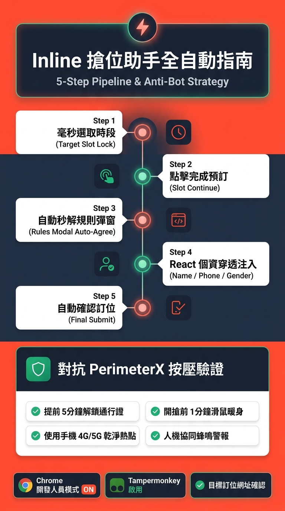
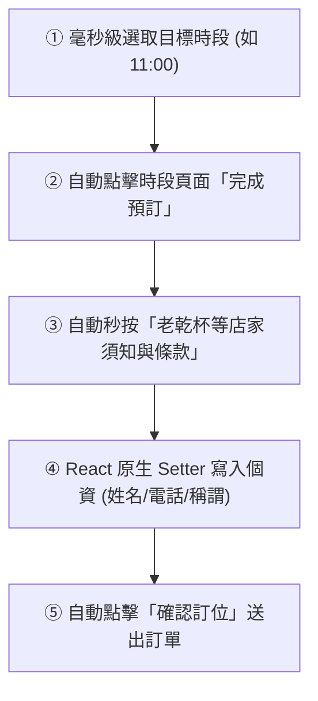

# Inline 餐廳自動搶位助手 — 完整使用者操作手冊 (User Manual)

本手冊詳細說明如何安裝、設定與實戰操作 **Inline 餐廳自動搶位助手 (Inline Booking Sniper)**。本腳本專為 inline.app 訂位系統設計，支援「準時放位開搶 (Opening Drop)」與「釋出撿漏輪詢 (Cancellation Sniping)」雙模式，並具備完整五步全自動流水線與反爬蟲防禦機制。

  

---

## 📑 目錄

1. [系統特色與自動化架構](#1-系統特色與自動化架構)
2. [安裝與環境配置 (Chrome MV3)](#2-安裝與環境配置-chrome-mv3)
3. [控制台參數設定說明](#3-控制台參數設定說明)
4. [標準搶位作業流程](#4-標準搶位作業流程)
5. [實戰防禦：對抗「按壓不放確認是人類」](#5-實戰防禦對抗按壓不放確認是人類)
6. [常見問題與故障排除 (FAQ)](#6-常見問題與故障排除-faq)

---

## 1. 系統特色與自動化架構

本助手直接在您本機已登入的 Google Chrome 瀏覽器中運作，避開傳統爬蟲的環境特徵偵測，並具備以下核心技術：

* ⏱️ **高精度伺服器對時**：動態計算與 inline 官方伺服器之時間偏差（Offset），消除本地時差。
* 🔄 **無刷新軟觸發 (Zero-Reload)**：開搶時全面採用前端狀態軟查詢，絕不呼叫 `location.reload()`，避免驚動防火牆。
* ⚡ **五步全自動流水線**：

---

## 2. 快速使用方式（瀏覽器主控台 Console 貼上法）

本助手為 **100% 純原生 JavaScript** 開發，**完全無需安裝 Tampermonkey（油猴）等任何擴充插件**，直接在瀏覽器 Console 貼上即可秒速啟動：

### 步驟 2.1：開啟目標餐廳訂位頁面
1. 使用 Google Chrome / Microsoft Edge / Safari / Brave 等主流瀏覽器，開啟您要預約的餐廳**專屬訂位頁面**（網址需帶有 `inline.app/booking/...`）。

### 步驟 2.2：打開開發者工具主控台 (Console)
1. 在目標訂位網頁上按下鍵盤快捷鍵：
   - **Windows / Linux**：按下 `F12` 或 `Ctrl + Shift + I`
   - **Mac**：按下 `Cmd + Option + I`
2. 於開發者工具頂部切換至 **「Console」（主控台）** 標籤頁。

### 步驟 2.3：貼上代碼並按 Enter
1. 複製專案中的 [`inline-reservation-bot.user.js`](./inline-reservation-bot.user.js) 完整代碼。
2. 直接貼上至 Console 的游標處，並按下 **Enter** 執行。
3. 頁面右下角將立即載入並**自動彈出「⚡ Inline 搶位助手」**控制面板！

---

## 3. 控制台參數設定說明

在訂位頁面點擊右下角紅色「**⚡ Inline 搶位助手**」按鈕即可展開設定台：

| 欄位名稱 | 設定範例 | 說明 |
| :--- | :--- | :--- |
| **搶位模式** | 準時放位開搶 / 釋出撿漏輪詢 | 放位開搶適合搶凌晨 00:00 或中午 11:00/12:00 開出的新日期；撿漏輪詢適合監控已客滿日期。 |
| **目標日期** | `2026-08-28` | 欲預約用餐的日期（格式：YYYY-MM-DD）。 |
| **放位時間** | `11:00:00` | 店家開放訂位的系統時間（格式：HH:mm:ss）。 |
| **大人 / 小孩人數** | `2 位 / 0 位` | 用餐人數設定。 |
| **優先時段清單** | `11:00, 11:30, 12:00` | 以逗點分隔，順序越靠前越優先抓取。 |
| **桌型偏好** | `板前吧台` 或 留空 | 指定偏好桌型（支援倒裝模糊比對，如 `吧台板前`）；留空則預設自動選取第一個可用桌型。 |
| **訂位人姓名** | `王大明` | 支援單姓、複姓與英文名，自動智慧拆解並寫入單欄位或雙欄位（姓、名）表單。 |
| **稱謂** | `先生 / 小姐 / 其他` | 自動點選 Radix UI 單選項目。 |
| **電話號碼** | `0912345678` | 訂位手機號碼（需能接收簡訊）。 |
| **Email** | `user@gmail.com` | 接收訂位確認信之電子信箱。 |
| **用餐備註** | `慶生 / 靠窗` | 可選，特殊需求備註。 |
| **免訂金自動送出** | `勾選` | 當預約無須預收信用卡保證金時，自動點擊確認訂位。 |
| **鈴聲通知** | `勾選` | 成功鎖定時段或遇突發狀況時發出音效提示。 |

設定完成後，請務必點擊 **「💾 儲存設定」**，設定將永久儲存在您的瀏覽器中。

---

## 4. 標準搶位作業流程

### 步驟一：進入「真正的餐廳訂位頁面」
> [!IMPORTANT]
> 請勿留在 `dining.inline.app/.../discover/...` 等餐廳探索分類頁面。  
> 必須點擊餐廳卡片上的「**訂位 ↗**」，進入帶有 `/booking/` 的專屬頁面（例如：`https://inline.app/booking/-Ksq_LYziPrwRXZXlsQT/-N7z6hF7kXdLjH9fEf9b`）。

### 步驟二：檢查對時與助手狀態
* 展開助手面板，查看最下方日誌是否顯示：  
  `⏱️ 伺服器對時完成，時間偏移值 (Offset): +xxx ms`。

### 步驟三：啟動搶位倒數
* 點擊綠色 **「🚀 啟動搶位」** 按鈕。
* 面板上方狀態會轉為「🟡 等待開搶中」並顯示精準到 0.1 秒的倒數計時器。
* **分頁注意事項**：請將此分頁獨立成一個視窗，放在螢幕一角保持可見，**不要最小化或讓電腦休眠**。

### 步驟四：開搶觸發與全自動接管
倒數歸零瞬間（T-0ms），助手會自動執行以下流水線：
1. 自動點選目標日期並在 150ms 內連續抓取第一志願時段與桌型。
2. 時段鎖定後，立即自動點擊下方「**完成預訂**」按鈕。
3. 若跳出店家「規則與注意事項」，自動勾選並秒按「**我已閱讀並同意**」。
4. 進入聯絡資訊頁面，自動填妥姓名（自動適配單欄或姓/名雙欄）、電話、Email 與稱謂。
5. 自動點擊「**確認訂位**」送出預訂！
6. 送出後發出慶祝提示音，您將在 1 分鐘內收到 inline 官方簡訊確認信。

---

## 5. 實戰防禦：對抗「按壓不放確認是人類」

inline 採用全球頂級防護系統 **PerimeterX (HUMAN Security)**。任何以程式碼偽造的點擊（`isTrusted: false`）均會被識破。實戰中最有效、勝率高達 99% 的核心戰術是**「預先拿通行證」**與**「人機協同」**：

### 策略 ①：開搶前 3～5 分鐘「提前解鎖通行證」（最神技巧）
* **原理**：PerimeterX 驗證通過後的通行證 Cookie（`_px3`）**有效期長達 30 分鐘到 1 小時**。
* **操作**：在開搶前 5 分鐘（例如 10:55），在畫面上隨意點選幾次日期或切換人數。如果跳出「按壓不放」，**提前用手按住 3 秒解開它**！
* **效果**：解開後瀏覽器即獲得合法通行權杖，**等到 11:00 正式放位開搶時，系統絕對不會再次彈出驗證擋您**！

### 策略 ②：開搶前 1 分鐘「滑鼠人工暖身」
* 在開搶前 1 分鐘（10:59:00～10:59:50），手動握著滑鼠在網頁上**隨意晃動、滾動滾輪**。
* 讓系統感應器收集到真實人類肌肉的微小震顫與速度變化，後台風控評分會降至最低。

### 策略 ③：使用「乾淨網路環境」
* 請使用**手機 4G/5G 行動熱點**或一般**家用中華電信寬頻**。
* **嚴禁使用公司內部公用 Wi-Fi、VPN 或 Proxy**，這類 IP 往往已被列入風控名單。

### 策略 ④：即時蜂鳴警報與人機極速交棒
* 助手內建 PerimeterX 偵測模組，萬一開搶時依然跳出驗證，瀏覽器會**立即響起高頻警報蜂鳴聲（Buzzer）**。
* 聽到警報時，請用滑鼠或手指**長按按鈕 3 秒通過**。
* **通過後的 100ms 內，助手會自動無縫接手**，把剩下的時段、個資與送出全自動跑完！

---

## 6. 常見問題與故障排除 (FAQ)

### Q1：為什麼在 `dining.inline.app/...` 分類頁面沒看到助手？
* 該頁面是「餐廳探索/推薦目錄」，並非實際訂位系統。請點擊列表中任何一家餐廳右側的「訂位 ↗」按鈕，進入店家專屬訂位頁面後助手即會就緒。

### Q2：主控台 (Console) 出現 `scontent-...fbcdn.net 403 (Forbidden)` 報錯？
* 這是 inline 官方網站引用的 Facebook 餐廳照片外連失效破圖，純屬網站前端圖片錯誤，與腳本無關，完全不會影響訂位功能。

### Q3：為什麼在部分店家（如島語）會出現「訂位人姓氏不可留空」？
* 部分店家在後台啟用了「雙欄位姓名格式 (`customerNameFields: 2`)」，將姓名拆成「姓」與「名」兩格。最新版助手已具備姓名智慧拆解引擎（支援單姓、複姓與英文姓名），並重設 React 18 內部 `_valueTracker` 派發完整 `InputEvent` 鏈，保證 100% 自動帶入並消除紅字。

### Q4：若店家要求「信用卡預授權保證金」會如何？
* 若店家需要預扣保證金，助手會自動為您鎖定時段並填妥個資，並在偵測到信用卡元件時**安全暫停自動送出**，發出警報提醒您手動輸入信用卡安全碼與 3D 簡訊驗證碼，守護資金安全。

### Q5：如何百分之百確認自己「真的訂到位了」？
1. 畫面跳轉至「預約成功 / 訂位完成」頁面並出現訂位代號。
2. **最可靠標準**：送出後 1 分鐘內，手機收到 inline 官方發出的 **SMS 訂位成功確認簡訊**。
